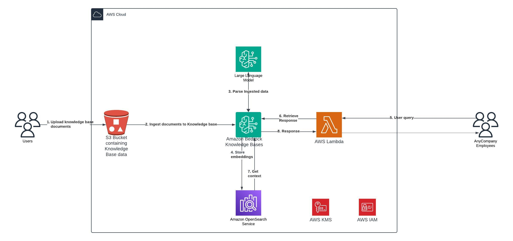

# Advanced RAG Assistant

This solution demonstrates a comprehensive implementation of an advanced Generative AI Assistant using [Amazon Bedrock Knowledge Bases](https://aws.amazon.com/bedrock/knowledge-bases/). The system enables foundation models and agents to leverage contextual information from private data sources, delivering highly relevant and customized responses. Notable features include advanced processing of complex graphs, images, and tables from documents, with automated deployment via AWS CloudFormation. Ideal for research, customer service, HR assistance, and various enterprise applications.

## Tech Stack

- **Amazon Bedrock Knowledge Bases**: Core RAG functionality
- **Amazon OpenSearch Serverless**: Vector database
- **Amazon S3**: Document storage
- **AWS Lambda**: API integration with Bedrock Knowledge Base

## Prerequisites

- AWS CLI
- Python
- Streamlit
 
## Architecture


## Solution Description
When ingesting your data, Amazon Bedrock Knowledge Bases first splits your documents or content into manageable chunks for efficient data retrieval. The chunks are then converted to embeddings and written to a vector index (vector representation of the data), while maintaining a mapping to the original document. The vector embeddings allow the texts to be quantitatively compared.
This solution utilizes [advanced parsing and chunking features](https://community.aws/content/2jU5zpqh4cal0Lm47MBdRmKLLJ5/a-developer-s-guide-to-advanced-chunking-and-parsing-with-amazon-bedrock?lang=en) of Amazon Bedrock Knowledge Bases. In addition to default and fixed size chunking, Knowledge bases has introduced semantic chunking and hierarchical chunking. If your document may benefit from inherent relationships within your document, it may be wise to use hierarchical chunking allowing for more granular and efficient retrieval. Some documents benefit from semantic chunking by preserving the contextual relationship in the chunks helping to ensure that the related information stays together in logical chunks.
The solution uses streamlit application as the front end for providing the chatbot interface. The streamlit application is making a call to [AWS Lambda](https://aws.amazon.com/lambda/) function which in turn calls Amazon Bedrock Knowledge Bases [RetrieveAndGenerate](https://docs.aws.amazon.com/bedrock/latest/APIReference/API_agent-runtime_RetrieveAndGenerate.html) API to get answer to the user's query.


## Deployment Guide

### 1. Template Preparation

Execute `deploy.sh` to create deployment resources:

```bash
bash deploy.sh  # Default bucket name: e2e-rag-deployment-${ACCOUNT_ID}-${AWS_REGION}
# or
bash deploy.sh <BUCKET_NAME>  # Custom bucket name: <BUCKET_NAME>-${ACCOUNT_ID}-${AWS_REGION}
```

After completion, copy the `main-template-out.yml` S3 URL for the next step.

### 2. Stack Deployment

Via AWS Console:

1. Navigate to CloudFormation Console
2. Select "Template source" as Amazon S3 URL
3. Input the S3 URL from step 1
4. Configure stack name and email
5. Deploy stack

## Usage Instructions

Deployment typically takes 7-10 minutes. Follow these steps to set up the system:

### Upload Source Files
1. Locate the SourceS3Bucket name in the ServerlessInfraStack outputs
2. Upload files to trigger automatic PDF processing

### Configure Knowledge Base
1. Access Amazon Bedrock Console
2. Select created Knowledge Base
3. Initiate sync
4. Choose Foundation Model and begin querying

### Email Verification
- Verify the provided email address via the received confirmation link

### Launch Streamlit Application

```bash
cd streamlit
python -m venv .env
source .env/bin/activate
python -m pip install -r requirements.txt
python -m streamlit run kb_chatbot.py
```

The chatbot interface will open in your default browser, ready for natural language interactions.

## Cleanup

1. Empty both SourceS3Bucket and KnowledgeBaseS3BucketName
2. Remove the main CloudFormation stack

## Contributing

We welcome community contributions! Please see [CONTRIBUTING.md](../CONTRIBUTING.md) for guidelines.